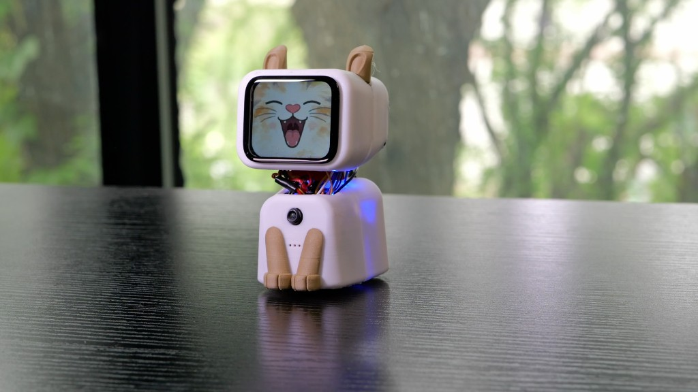
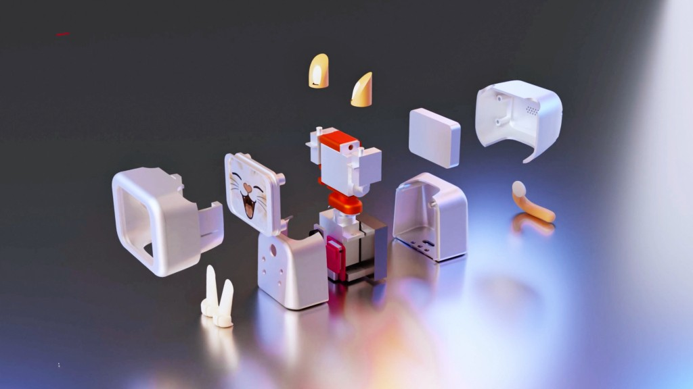
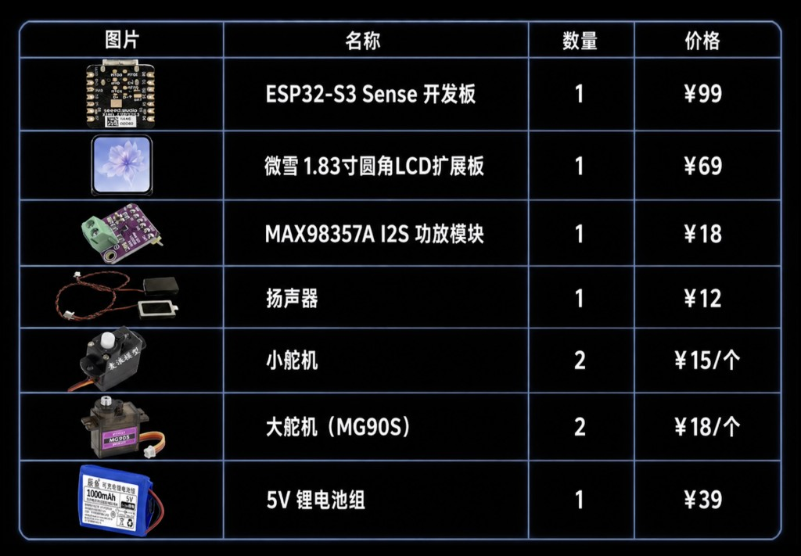
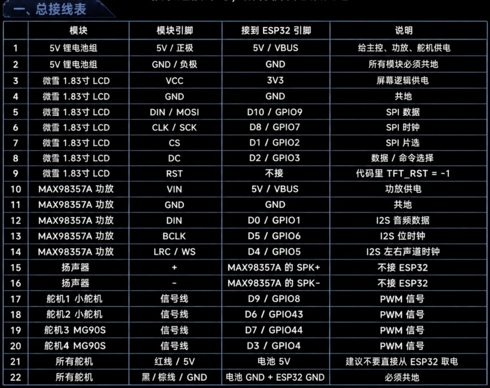
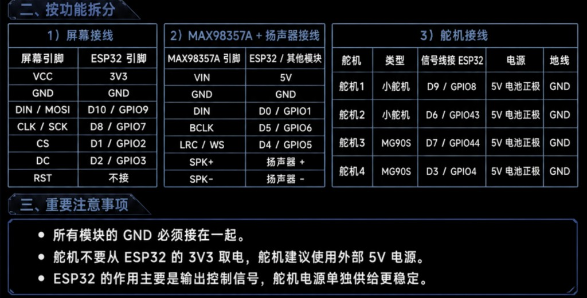
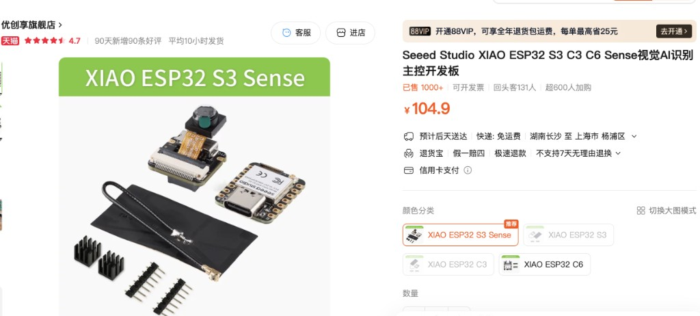
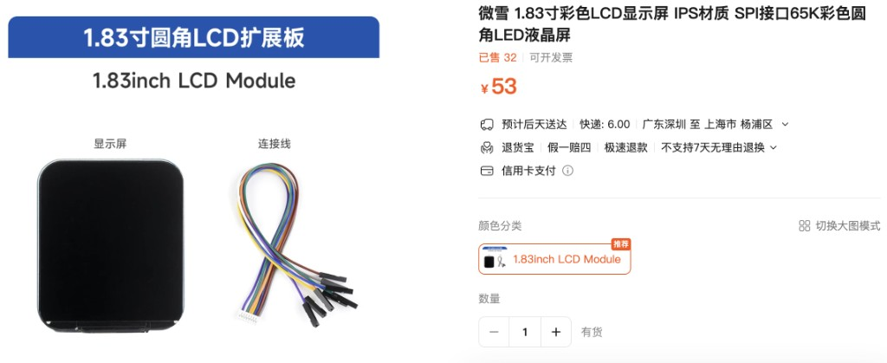
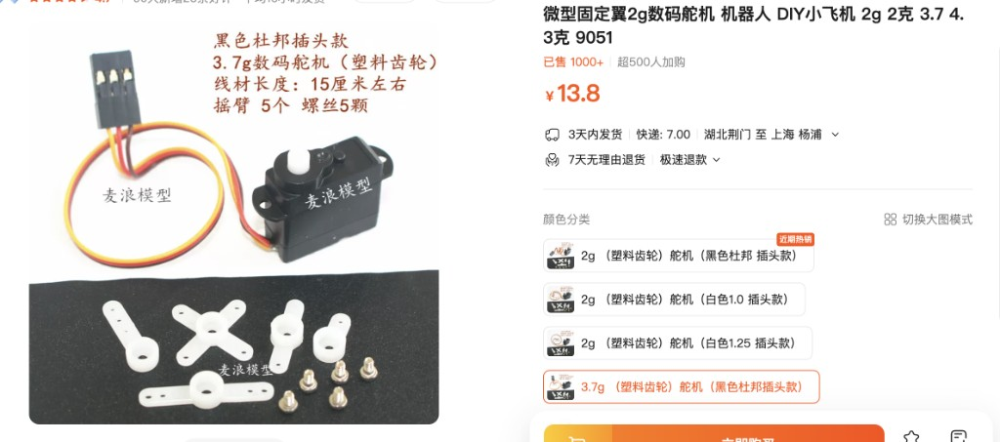
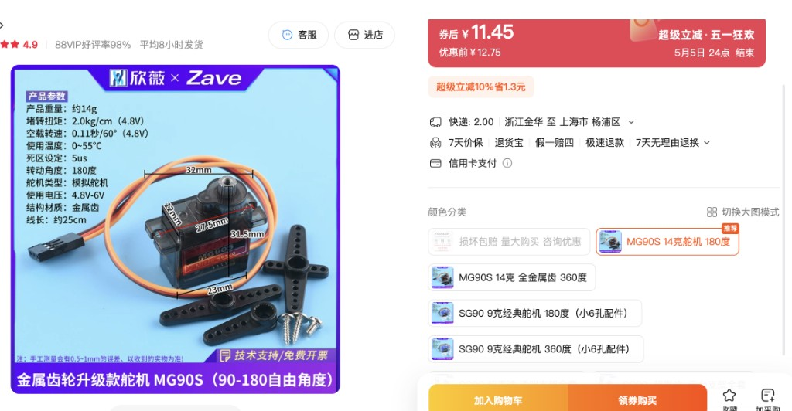

# AICat 复刻教程

AICat 是一个基于 `Seeed XIAO ESP32S3 Sense` 的桌面机器猫项目。它把屏幕表情、摄像头、麦克风、扬声器、舵机动作和网页控制整合在一起，适合硬件爱好者按步骤复刻、改造和继续扩展。

这个仓库已经把真实密钥和本地素材清理掉了。你需要准备自己的 Wi-Fi、DashScope API Key，以及动画/表情素材。

## 项目总览

### 成品效果



### 结构拆解



### 主要物料清单



### 总接线表



### 按功能拆分的接线参考



## 项目能做什么

- 用 `ST7789` 小屏显示状态、文字和表情动画。
- 用 XIAO ESP32S3 Sense 板载摄像头把画面传到电脑端网页。
- 用板载麦克风采集语音，交给后端做 ASR 和 AI 对话。
- 用 `MAX98357A` 播放 AI 回复或提示音。
- 用 `PCA9685` 控制嘴巴、尾巴、耳朵等普通 PWM 舵机。
- 用 `STS3032` 总线舵机控制四条腿，并支持走路、坐下、跳跃等动作。
- 用浏览器打开后端控制台，调试视频、语音、表情和舵机。

## 当前推荐入口

- ESP32 主固件：`upload_facial_expression/integrated/integrated.ino`
- Python 后端：`upload_facial_expression/integrated/server/app.py`
- 后端依赖：`upload_facial_expression/integrated/server/requirements.txt`
- 表情/动画生成工具：`upload_facial_expression/flash_files/`、`upload_facial_expression/mouth_flash_files/`

旧的本地测试入口和大体积生成文件已经清理，根目录只保留项目说明和主要源码。

## 你需要准备的硬件

- `Seeed XIAO ESP32S3 Sense`，带摄像头和麦克风版本。
- `ST7789` SPI 屏幕，当前代码按 `170x320` 屏幕调试。
- `MAX98357A` I2S 功放模块和小喇叭。
- `PCA9685` 16 路 PWM 舵机驱动板。
- `STS3032` 总线舵机和对应 TTL/总线转接模块。
- 普通 PWM 舵机若干，用于嘴巴、尾巴、耳朵等动作。
- 外部舵机电源，按你的舵机规格选择，一般不要直接从 ESP32 给舵机供电。
- 杜邦线、面包板或自制 PCB、USB 数据线、稳定的 5V/舵机电源。

重要提醒：所有外部电源的 `GND` 必须和 ESP32 的 `GND` 共地。舵机电流较大，供电不稳会导致重启、抽搐或串口乱码。

## 主要材料购买搜索参考

下面这些图是购买时可以参考的关键词和外观。不同店铺标题会有差异，重点看型号、尺寸、接口和电压参数是否匹配。

### XIAO ESP32S3 Sense 主控

搜索关键词：`Seeed Studio XIAO ESP32S3 Sense 摄像头 麦克风`、`XIAO ESP32 S3 Sense 视觉 AI`。



注意要买 `Sense` 版本，不是普通 `XIAO ESP32S3`。Sense 版本带摄像头扩展板和板载麦克风，本项目的视频和语音输入依赖它。

### 1.83 寸圆角 SPI LCD 屏

搜索关键词：`1.83寸 圆角 LCD SPI IPS 65K`、`1.83inch LCD Module SPI`。



当前代码按 `ST7789`、`170x320` 一类小屏调试。购买时确认是 `SPI` 接口，并留意排线/杜邦线接口是否方便接到 XIAO。

### 小型 2g / 3.7g 塑料齿轮舵机

搜索关键词：`2g 数码舵机 塑料齿轮`、`3.7g 舵机 180度`、`机器人 DIY 小舵机`。



这类舵机适合做耳朵、嘴巴、小尾巴等轻负载动作。优先选 `180度` 普通 PWM 舵机，注意不要让结构卡死，否则容易烧舵机。

### MG90S 金属齿轮舵机

搜索关键词：`MG90S 14克 金属齿轮 舵机 180度`、`MG90S 90-180 自由角度`。



MG90S 比 2g 小舵机力矩更大，适合负载稍高的位置。购买时选 `180度` 版本，不要买成连续旋转 `360度` 版本，除非你已经改了控制逻辑。

## 接线说明

按 `upload_facial_expression/integrated/integrated.ino` 当前配置接线。

屏幕 `ST7789`：

- `CS` 接 `D0`
- `DC` 接 `D1`
- `RST` 接 `EN`，代码里配置为不单独控制复位脚
- `SCK` 接 `D8`
- `MOSI` 接 `D10`
- `VCC` 接 `3.3V`
- `GND` 接 `GND`

`PCA9685` 舵机驱动：

- `SDA` 接 `D4`
- `SCL` 接 `D5`
- `VCC` 接 `3.3V` 或 `5V`，看模块说明
- `V+` 接外部舵机电源
- `GND` 接公共地
- 当前代码约定 `CH12=嘴巴`、`CH13=尾巴`、`CH14=左耳`、`CH15=右耳`

`STS3032` 总线舵机：

- `TX` 接 `D6 / GPIO43`
- `RX` 接 `D7 / GPIO44`
- 波特率为 `1000000`
- 当前代码约定 `ID1=左前腿`、`ID2=右前腿`、`ID3=左后腿`、`ID4=右后腿`

`MAX98357A` 扬声器模块：

- `BCLK` 接 `D3 / GPIO4`
- `LRC` 接 `D2 / GPIO3`
- `DIN` 接 `D9 / GPIO8`
- `VCC` 接 `5V`
- `GND` 接公共地

摄像头和麦克风使用 `XIAO ESP32S3 Sense` 板载硬件，不需要额外接线。

## 电脑环境准备

建议使用 macOS、Windows 或 Linux 都可以，下面命令以 macOS/Linux 终端为例。

1. 安装 Python，建议 `3.10` 到 `3.12`。
2. 安装 Arduino IDE。
3. 在 Arduino IDE 里安装 ESP32 开发板支持。

   如果 Arduino IDE 还没有 ESP32 板卡包，打开 `Arduino IDE -> Settings`，在 `Additional boards manager URLs` 里加入：

   ```text
   https://raw.githubusercontent.com/espressif/arduino-esp32/gh-pages/package_esp32_index.json
   ```

   然后打开 `Tools -> Board -> Boards Manager`，搜索 `esp32`，安装 `esp32 by Espressif Systems`。

4. 选择开发板 `XIAO ESP32S3` 或 `Seeed XIAO ESP32S3`。
5. 打开 PSRAM。摄像头和动画缓存需要 PSRAM。
6. 上传代码前先确认分区表。

   这个项目会把 facial expression 素材写进 `LittleFS`，默认分区空间通常不够。烧录写入工具和最终主固件时，都要使用同一套带较大文件系统空间的分区表。

   推荐做法：

   - 如果 Arduino IDE 的 `Tools -> Partition Scheme` 里有 `Custom`，选择 `Custom`。
   - 确认当前 sketch 目录里有对应的 `partitions.csv`，例如 `upload_facial_expression/integrated/partitions.csv`、`upload_facial_expression/flash_files/partitions.csv` 或 `upload_facial_expression/mouth_flash_files/partitions.csv`。
   - 如果你的 Arduino IDE 没有 `Custom` 选项，可以先选 `8M with spiffs` 或 `No OTA (Large APP)` 这类空间更大的选项；素材多时再参考 `upload_facial_expression/分区表说明.md` 配自定义分区。
   - 改分区表会清空 ESP32 Flash 里的文件系统数据，所以改完分区后要重新上传 facial expression 素材。

7. 安装 Arduino 库。

   在 Arduino IDE 打开 `Tools -> Manage Libraries`，逐个搜索并安装这些库：

```bash
ESP32Servo
Adafruit GFX Library
Adafruit ST7735 and ST7789 Library
Adafruit PWM Servo Driver Library
ArduinoWebsockets
JPEGDEC
SCServo
```

如果 Arduino IDE 搜不到某个库，可以去库作者的 GitHub 下载 ZIP 后用“项目 -> 加载库 -> 添加 .ZIP 库”导入。

## 配置后端服务

进入后端目录并安装依赖：

```bash
cd upload_facial_expression/integrated/server
python3 -m venv .venv
source .venv/bin/activate
pip install -r requirements.txt
```

如果你用 Windows PowerShell，激活虚拟环境的命令通常是：

```powershell
.venv\Scripts\Activate.ps1
```

创建本地环境变量文件：

```bash
cat > .env << 'EOF'
DASHSCOPE_API_KEY=sk-your-api-key-here
ASR_DEBUG_RAW=0
EOF
```

`DASHSCOPE_API_KEY` 要换成你自己的阿里云 DashScope API Key。不要把真实 `.env` 上传到 GitHub。

启动后端：

```bash
python app.py
```

默认服务地址是：

```text
http://0.0.0.0:8081
```

在浏览器里访问电脑局域网地址，例如：

```text
http://192.168.2.7:8081
```

电脑 IP 要以你自己的局域网为准。macOS 可以在“系统设置 -> Wi-Fi -> 详细信息”里看，也可以运行：

```bash
ipconfig getifaddr en0
```

## 配置 ESP32 固件

打开文件：

```text
upload_facial_expression/integrated/integrated.ino
```

先修改 Wi-Fi 和电脑后端地址：

```cpp
const char* WIFI_SSID   = "YOUR_WIFI_SSID";
const char* WIFI_PASS   = "YOUR_WIFI_PASSWORD";
const char* SERVER_HOST = "192.168.2.7";
const uint16_t SERVER_PORT = 8081;
```

把 `YOUR_WIFI_SSID`、`YOUR_WIFI_PASSWORD` 换成你的 Wi-Fi，把 `SERVER_HOST` 换成运行 Python 后端那台电脑的局域网 IP。

Arduino IDE 推荐设置：

- Board：`XIAO ESP32S3`
- PSRAM：`Enabled`
- USB CDC On Boot：`Enabled`，方便看串口日志
- Upload Speed：先用稳定值，如果失败再降低
- Partition Scheme：上传前必须和 facial expression 写入工具保持一致，推荐 `Custom` 或带大文件系统空间的 8MB 分区方案

确认分区表后再点击上传。烧录完成后打开串口监视器，波特率按代码或 IDE 默认设置查看日志。你应该能看到 Wi-Fi 连接和 WebSocket 连接相关输出。

## 第一次联调

建议按这个顺序排查，先让最小链路跑通，再逐步打开复杂功能。

1. 先启动 Python 后端，确认浏览器能打开 `http://电脑IP:8081`。
2. 再给 ESP32 上电，串口里确认它连上同一个 Wi-Fi。
3. 看后端终端是否出现 camera/audio WebSocket 连接日志。
4. 在网页里查看摄像头画面是否出现。
5. 测试屏幕文字或表情命令。
6. 单独测试 PCA9685 上的嘴巴、尾巴、耳朵舵机。
7. 单独测试 STS3032 四腿舵机，确认 ID 和方向没有接反。
8. 最后再测试语音输入、AI 回复和扬声器播放。

如果网页能打开但 ESP32 连不上，通常是 `SERVER_HOST` 写错、电脑防火墙拦截、ESP32 和电脑不在同一个局域网，或者路由器开启了 AP 隔离。

## 表情和动画素材

为了让仓库适合上传 GitHub，大体积素材和生成出的 `batch_*.h`、`mouth_batch_*.h` 没有放进仓库。你可以自己准备素材后重新生成。

相关工具在：

- `upload_facial_expression/flash_files/generate_all_headers.py`
- `upload_facial_expression/flash_files/video_to_jpeg_frames.py`
- `upload_facial_expression/flash_files/audio_to_adpcm.py`
- `upload_facial_expression/mouth_flash_files/generate_mouth_headers.py`
- `upload_facial_expression/mouth_flash_files/video_to_jpeg_frames.py`

### 上传 facial expression 到 ESP32

表情素材最终会写入 ESP32 的 `LittleFS`。流程分成两步：先把素材转换成可烧录的头文件，再用专门的写入固件分批写进 Flash。

1. 准备表情帧素材。

   推荐把每个表情或动画放成单独文件夹，文件名按顺序编号，例如：

   ```text
   upload_facial_expression/data/
   ├── anim1/
   │   ├── 0001.jpg
   │   ├── 0002.jpg
   │   └── ...
   ├── anim2/
   │   └── ...
   └── anim3/
       └── ...
   ```

   图片建议使用 `JPEG`，尺寸控制在屏幕能显示的范围内，例如 `170x320` 或更小。单张图片越小，上传越稳，也越不容易塞爆 Flash。

2. 生成表情批次头文件。

   ```bash
   cd upload_facial_expression/flash_files
   python3 generate_all_headers.py
   ```

   脚本会扫描 `upload_facial_expression/data/`，生成 `batch_1.h`、`batch_2.h` 等文件。每个批次控制在较小体积，避免 Arduino 编译时超限。

3. 用写入工具烧录第一批。

   打开：

   ```text
   upload_facial_expression/flash_files/flash_files.ino
   ```

   把文件顶部的批次号设为 `1`：

   ```cpp
   #define BATCH_NUMBER 1
   ```

   在 Arduino IDE 里选择和主固件一致的开发板、PSRAM 和分区表设置。这里很关键：上传 `flash_files.ino` 前也要选同一份自定义分区表，不能写入工具用一种分区、最终 `integrated.ino` 又用另一种分区。

   然后上传这个写入工具。打开串口监视器，第一次写入时输入：

   ```text
   F
   W
   ```

   `F` 会格式化 LittleFS，`W` 会把当前批次写入 Flash。只在第一批或你想清空重来时使用 `F`。

4. 继续写入后续批次。

   如果生成了多个 `batch_*.h`，就重复下面步骤：

   - 把 `BATCH_NUMBER` 改成 `2`、`3`、`4` ...
   - 重新上传 `flash_files.ino`
   - 串口只输入 `W`

   后续批次不要再输入 `F`，否则会把前面已经写进去的表情素材清空。

5. 写入嘴部表情素材。

   嘴部素材使用独立目录，推荐结构如下：

   ```text
   upload_facial_expression/mouth_flash_files/data/
   ├── mouth_closed/
   ├── mouth_small_open/
   ├── mouth_big_open/
   ├── mouth_wide/
   └── mouth_round/
   ```

   生成嘴部批次头文件：

   ```bash
   cd upload_facial_expression/mouth_flash_files
   python3 generate_mouth_headers.py
   ```

   然后打开：

   ```text
   upload_facial_expression/mouth_flash_files/mouth_flash_files.ino
   ```

   按 `mouth_batch_1.h`、`mouth_batch_2.h` 的数量修改 `BATCH_NUMBER`，上传前继续使用同一套分区表。每次上传后在串口输入 `W`。这里也不要输入 `F`，否则会清空之前写入的普通表情动画。

6. 烧回主固件。

   所有表情和嘴部素材写入完成后，再重新烧录主固件：

   ```text
   upload_facial_expression/integrated/integrated.ino
   ```

   主固件启动后会从 LittleFS 读取这些素材，用于屏幕表情、嘴部动画和情绪动作。

### 分区表注意事项

如果素材比较多，默认文件系统空间可能不够。可以参考 `upload_facial_expression/分区表说明.md`，使用项目里的自定义分区表：

- `upload_facial_expression/partitions_custom.csv`
- `upload_facial_expression/flash_files/partitions.csv`
- `upload_facial_expression/mouth_flash_files/partitions.csv`
- `upload_facial_expression/integrated/partitions.csv`

关键点是：写入工具和最终主固件要使用兼容的分区表。修改分区表会清空 Flash 里的文件系统数据，所以改完分区后需要重新上传表情素材。

推荐顺序是：先确定分区表，再上传 `flash_files.ino` 写普通表情，再上传 `mouth_flash_files.ino` 写嘴部表情，最后上传 `integrated.ino`。中途不要再切换分区表。

生成物体积很大，建议只保存在本地，不要提交到 GitHub。仓库的 `.gitignore` 已经忽略了 `batch_*.h` 和 `mouth_batch_*.h`。

## 常见问题

### 后端启动后提示没有 API Key

检查 `upload_facial_expression/integrated/server/.env` 是否存在，里面是否写了：

```bash
DASHSCOPE_API_KEY=sk-your-api-key-here
```

如果你只想测试硬件，可以先不配置 AI 功能，优先验证网页、视频、舵机和屏幕。

### ESP32 一动舵机就重启

大概率是舵机供电不足或没有共地。舵机电源请单独供电，并把外部电源 `GND` 和 ESP32 `GND` 接在一起。

### 摄像头没有画面

先看串口是否初始化摄像头成功，再看后端是否收到 `/ws/camera` 连接。还要确认 ESP32 和电脑在同一 Wi-Fi，`SERVER_HOST` 是电脑 IP，不是 ESP32 IP。

### 扬声器没声音

检查 `MAX98357A` 的 `BCLK/LRC/DIN` 是否和代码一致，喇叭是否接好，模块供电是否为 `5V`。如果你改过引脚，需要同步改 `integrated.ino` 里的 `I2S_SPK_BCLK`、`I2S_SPK_LRCK`、`I2S_SPK_DIN`。

### STS3032 舵机动作不对

确认舵机 ID 是否和代码约定一致，串口 TX/RX 是否接反，供电电压是否符合舵机要求。第一次测试时不要让机构承受负载，先空载验证方向和角度范围。


## 后续可改造方向

- 给猫做更稳定的外壳和舵机固定结构。
- 把 Wi-Fi 配置做成网页配网，避免每次改代码烧录。
- 把表情素材做成可替换包。
- 给动作系统增加更多情绪映射，例如开心、困、撒娇、生气。
- 增加电池供电和低电量保护。
